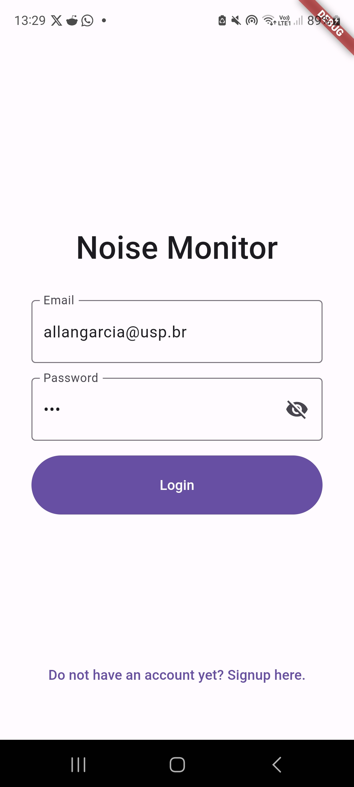
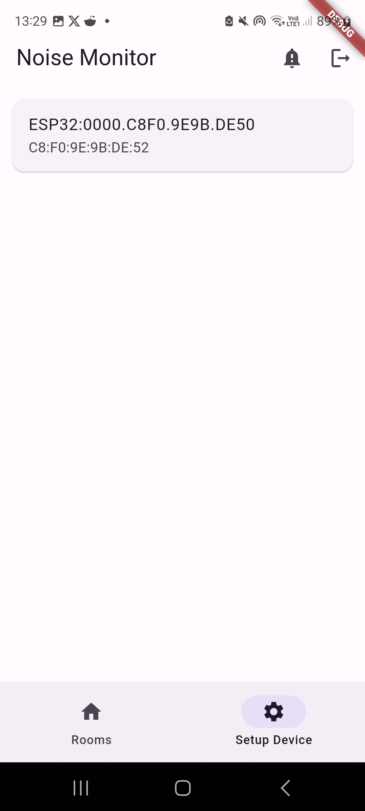
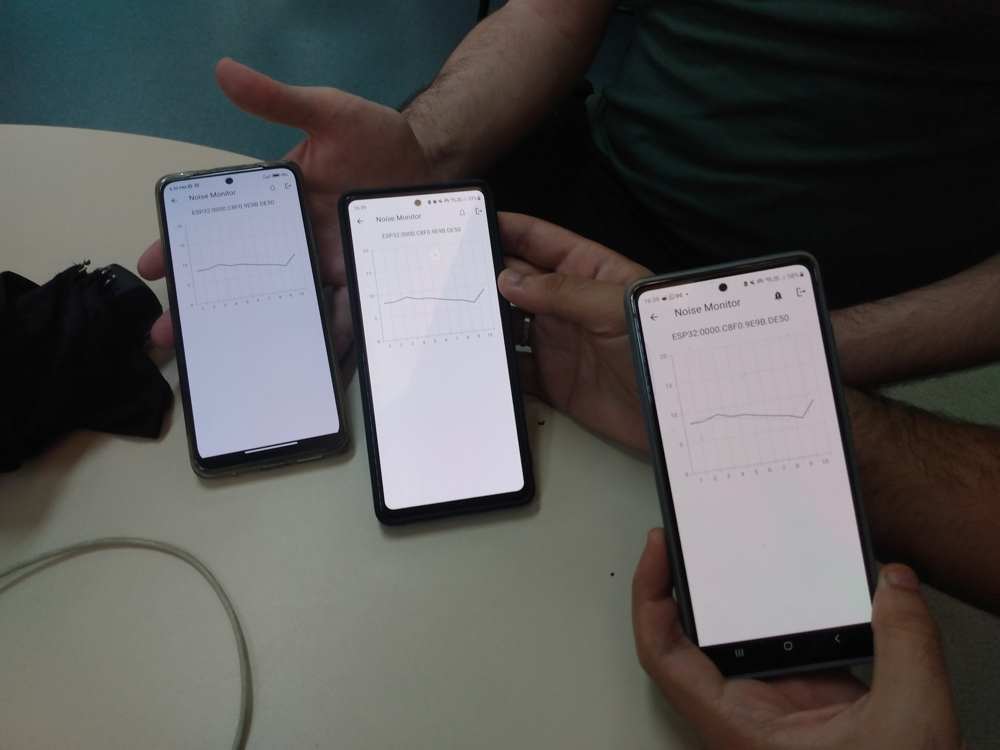

# Projeto Final - Internet das Coisas (SSC-0952)

Em ambientes como salas de estudos e laboratórios de computação, a manutenção do
silêncio é crucial para garantir a concentração nas tarefas em andamento. Além disso, o excesso
de ruído em um ambiente afeta não apenas as pessoas presentes no local, mas também prejudica
aqueles em áreas adjacentes.

Para abordar essa questão, este estudo se concentra no controle do ruído e na ocupação
de dois laboratórios de computação localizados nas salas 1-006 e 1-008 do ICMC. Essas salas
são normalmente utilizadas para a realização de tarefas e trabalhos, tornando importante a análise
do nível de ruído produzido por meio de um aplicativo de celular.





## Tecnologias

São incorporadas diversas tecnologias, incluindo:

- **PlatformIO**, para a programação da ESP32, abrangendo todo o processo de desenvolvimento, compilação e envio do programa para o dispositivo.

- **Flutter**, para o aplicativo cliente para mobile, que pode ser compilado para iOS e Android.

- **Python/FastAPI e PostgreSQL**, para o backend da aplicação, que pode ser executado em qualquer servidor Linux com acesso a Docker.

- **Mosquitto**, como broker MQTT e responsável pela comunicação entre as ESPs e o Python.

Apesar de estar tudo no mesmo repositório, é importante notar que as partes são altamente modulares. O Python, o Postgres e o Mosquitto podem, por exemplo, ser executados em máquinas distintas, bastando configurar os devidos endereços e portas.

Ressalta-se que, para a implantação completa, nem tudo podem ser executado no servidor Linux, uma vez que a programação da ESP requer a conexão direta com o dispositivo via USB para o envio do firmware. Esse requisito implica que determinadas etapas do desenvolvimento e atualização do firmware devem ser realizadas em um computador local.

Com relação ao aplicativo móvel, foi desenvolvido um script que gera um arquivo .apk, proporcionando a instalação em qualquer dispositivo Android. Contudo, a maneira mais simplificada de instalação envolve a conexão direta do dispositivo ao servidor por meio de um cabo USB, seguido pela execução de um comando específico para realizar a instalação.

Para otimizar a consistência e praticidade do ambiente de desenvolvimento e implementação, todas as tecnologias envolvidas foram Docker. Essa abordagem assegura que tanto o servidor quanto a máquina destinada ao deploy para a ESP e o dispositivo Android não necessitem de instalações adicionais de dependências, simplificando o processo de configuração e promovendo a uniformidade do ambiente.

## Configuração

A partir de agora, vamos considerar que esse repositório foi clonado em ao menos duas máquinas: um servidor Linux no qual serão executados o Python, o Postgres e o Mosquitto; e uma máquina local, também com Linux, com acesso via USB à ESP32 e a um smartphone Android.

Você deve criar um arquivo de configurações chamado de `config.env` no diretório raiz. Ele deve conter seguir o seguinte modelo:

```shell
API_SECRET_KEY=""
API_HOST=""
API_PORT=8045

POSTGRES_USER=""
POSTGRES_PASSWORD=""
POSTGRES_DB="main"
POSTGRES_HOST="database"
POSTGRES_PORT=5432

MOSQUITTO_USER=""
MOSQUITTO_PASSWORD=""
MOSQUITTO_HOST="broker"
MOSQUITTO_PORT=1883
```

Abaixo segue a explicação de cada campo:

- `API_SECRET_KEY`: Chave secreta para assinar a autenticação dos usuários. Pode ser gerada com o comando: `openssl rand -hex 32`.
- `API_HOST`: IP ou URL do servidor em que será exposta a aplicação em Python.
- `API_PORT`: Porta na qual será exposta a aplicação em Python.
- `POSTGRES_USER`: Nome de usuário para acesso ao banco de dados.
- `POSTGRES_PASSWORD`: Senha do usuário do banco de dados.
- `POSTGRES_DB`: Nome do banco de dados utilizado pela aplicação.
- `POSTGRES_HOST`: Porta na qual será exposto exposto o banco de dados. Caso deseje utilizar sob o mesmo Docker Compose do Python, mantenha o valor `database`.
- `POSTGRES_PORT`: IP ou URL do servidor em que será exposto o banco de dados. Caso deseje utilizar sob o mesmo Docker Compose do Python, mantenha o valor `5432`.
- `MOSQUITTO_USER`: Nome de usuário para acesso ao ao broker MQTT.
- `MOSQUITTO_PASSWORD`: Senha do usuário do broker MQTT.
- `MOSQUITTO_HOST`: IP do servidor em que será exposto o broker MQTT. Não pode ser URL por razões de compatibilidade com a ESP.
- `MOSQUITTO_PORT`: Porta na qual será exposto exposto o broker MQTT.

O arquivo `config.env` contém um exemplo funcional e considera que o servidor Linux possui IP `143.107.232.252` e o firewall está configurado para abrir as portas `7045` e `8045`.

Obrigatoriamente, é necessário conferir o IP do servidor Linux (que será comum ao Broker e ao Python) e as portas a serem expostas.

No caso de uma aplicação real, por segurança, é altamente recomendado trocar as senhas e a chave secreta, porém a aplicação funcionará corretamente com os valores providos. Aqui todas foram geradas com o comando `openssl rand -hex 32`.

O restante pode manter conforme preenchido.

Certifique-se que esse arquivo de configuração está igual em ambas as máquinas, no servidor e na máquina em que serão configurados a ESP e o smartphone.

O restante das informações está dividido entre os arquivos:

1. Para o backend e o broker: `./backend/README.md`
2. Para o programa da ESP: `./embedded/README.md`
3. Para o cliente Android: `./frontend/noise_monitor/README.md`

Os caminhos de arquivos referenciados por esses READMEs assumem que estão relativos à pasta do README em questão.
